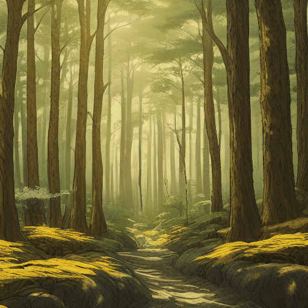
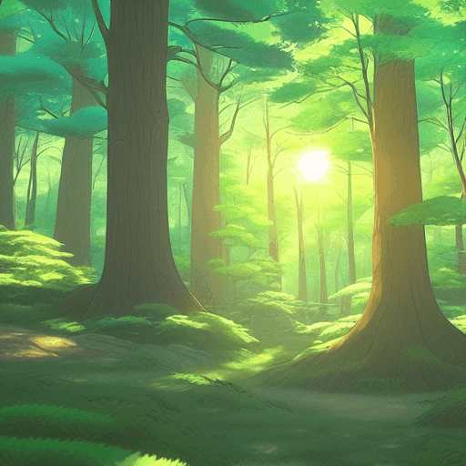

# 🌿 Ghibli-Style Animation Generator 🎨✨

This project is an AI-powered animation generator that creates frame-by-frame, Ghibli-style animations from natural language prompts. Using a combination of OpenAI GPT models, Stable Diffusion pipelines (txt2img, img2img), and ControlNet, the system produces coherent and stylized animated sequences in the spirit of Studio Ghibli’s visual aesthetic.

---

### 🎞️ Sample Output






---

## 🚀 Features

- 🎬 **Natural Prompt to Animation**: Enter a single prompt (e.g. “a serene forest at dawn...”) and receive a full animation sequence.
- 🖼️ **Frame-by-Frame Generation**: Uses Stable Diffusion to generate the first frame from text, and `img2img` to evolve subsequent frames.
- 🧠 **LLM-Assisted Scene Breakdown**: Breaks a high-level idea into a sequence of structured animation steps using OpenAI GPT-4o or Mistral.
- 🎛️ **Style Control via LoRA + ControlNet**: Ensures stylistic consistency and smooth motion using LoRA fine-tuning and depth-based ControlNet conditioning.
- 🪄 **Smooth Transitions**: Automatically blends frames for smoother animation and less jitter using pixel-wise interpolation.
- 📽️ **GIF Output**: Compiles frames into a looping animated GIF.

---

## 📦 Tech Stack

- **Python**
- **Stable Diffusion v1.5** (`diffusers`)
- **Mistral-7B-Instruct (via HF)**
- **ControlNet (Depth)**
- **LoRA fine-tuning**
- **Pillow**, **OpenCV**, **Torch**, **Transformers**

---

## 🎨 Ghibli-Style Animation Generator: Fine-Tuning & Image Generation with LoRA

This section provides a deep dive into how this project leverages **Stable Diffusion**, **LoRA fine-tuning**, and **ControlNet** to produce stylistically consistent Ghibli-themed animation frames from user prompts.

---

### 🌍 Base Model Setup: Stable Diffusion v1.5

We start with the `runwayml/stable-diffusion-v1-5` model as the base for all image generation tasks:

```python
from diffusers import StableDiffusionPipeline, DPMSolverMultistepScheduler

pipe = StableDiffusionPipeline.from_pretrained(
    "runwayml/stable-diffusion-v1-5",
    safety_checker=None,
    torch_dtype=torch.float16
)
pipe.scheduler = DPMSolverMultistepScheduler.from_config(pipe.scheduler.config)
pipe.to("cuda")
```

This pipeline is later enhanced using **LoRA fine-tuned weights** to give it a distinct Ghibli-style output capability.

---

### 🔧 LoRA Fine-Tuning: Tailoring SD to Ghibli Style

LoRA (Low-Rank Adaptation) allows efficient fine-tuning of large diffusion models by injecting small trainable matrices into attention layers. Instead of modifying the entire UNet weights, LoRA adjusts only a small subset of parameters, significantly reducing compute requirements.

#### 📁 Dataset Preparation & Upload

1. Captioned images are paired in a CSV (`metadata.csv`).
2. Images + captions are wrapped as a Hugging Face `datasets.Dataset` and pushed to the Hub:

```python
from datasets import Dataset, Image

# DataFrame setup
df["image"] = df["file_name"].apply(lambda fn: os.path.join(image_folder, fn))
ds = Dataset.from_pandas(df).cast_column("image", Image())
ds.push_to_hub("ibrahim7004/lora-ghibli-images", split="train")
```

#### 🎓 Fine-Tuning Execution

Using Hugging Face's `train_text_to_image_lora.py`, the model is fine-tuned with custom captions:

```bash
accelerate launch train_text_to_image_lora.py \
  --pretrained_model_name_or_path="runwayml/stable-diffusion-v1-5" \
  --dataset_name="ibrahim7004/lora-ghibli-images" \
  --caption_column="caption" \
  ...
  --output_dir="./finetune_lora/ghibli"
```

Training runs for 3000 steps, saving LoRA weights as `pytorch_lora_weights.safetensors`.

#### 🔄 Loading LoRA Weights

Once trained, the model is reloaded with LoRA weights like so:

```python
lora_path = hf_hub_download(repo_id="ibrahim7004/ghibli-stableDiff-finetuned", filename="v2_pytorch_lora_weights.safetensors")
pipe.unet.load_attn_procs(lora_path)
```

---

### 📸 Image Generation: Frame-by-Frame

The animation generation process consists of two parts:

- **Frame 0**: Generated from scratch via text-to-image
- **Frame 1 onward**: Generated using img2img with ControlNet for frame consistency

```python
if idx == 0:
    image = pipe(prompt=frame, ...).images[0]
else:
    refined = img2img_pipe(
        prompt=frame,
        image=saved_image,
        control_image=get_depth_map(saved_image),
        ...
    ).images[0]
```

#### 🔮 ControlNet (Depth)

To maintain visual continuity, we use `lllyasviel/sd-controlnet-depth`:

```python
controlnet = ControlNetModel.from_pretrained("lllyasviel/sd-controlnet-depth")
img2img_pipe = StableDiffusionControlNetImg2ImgPipeline.from_pretrained(
    base_model,
    controlnet=controlnet,
    ...
)
```

A simple grayscale depth map is generated from the last frame:

```python
def get_depth_map(image_pil):
    gray = cv2.cvtColor(np.array(image_pil), cv2.COLOR_RGB2GRAY)
    depth = cv2.normalize(gray, None, 0, 255, cv2.NORM_MINMAX)
    return Image.fromarray(depth).convert("RGB")
```

---

### 🎥 Animation Compilation

All saved frames (as `frame_0.png`, `frame_1.png`, ...) are stitched into a GIF for easy preview:

```python
def create_gif_from_frames(folder_path="/content/frames", output_path="/content/animation.gif"):
    frames = [Image.open(...)]
    frames[0].save(output_path, format="GIF", save_all=True, append_images=frames[1:], loop=0)
    display(IPyImage(filename=output_path))
```

---

## 🧪 How the entire pipeline Works

### 1. Prompt Breakdown (LLM)

Uses `mistralai/Mistral-7B-Instruct-v0.3` via Hugging Face Inference API to convert a natural prompt into a Python list of frame contexts.

```python
from huggingface_hub import InferenceClient
client = InferenceClient(provider="hf-inference", api_key="hf_...")

def generate_animation_frames(prompt, steps=5):
    system_message = (
        f"You are an animation assistant to help create ghibli-themed animation frames. "
        f"Each frame must include the word 'ghibli' or describe the frame as 'ghibli-style'. "
        f"Break the given ghibli-themed idea into a smooth {steps}-step animation. "
        f"Return the result as a Python list of {steps} strings."
    )
    completion = client.chat.completions.create(
        model="mistralai/Mistral-7B-Instruct-v0.3",
        messages=[
            {"role": "system", "content": system_message},
            {"role": "user", "content": prompt}
        ]
    )
    return completion.choices[0].message.content
```

### 2. Normalize Output

Mistral's output is parsed and cleaned using a custom parser to return a valid list of frames.

```python
import ast, re

def normalize_llm_frame_output(raw_output, steps=5):
    try:
        parsed = ast.literal_eval(raw_output)
        if isinstance(parsed, list):
            return parsed[:steps]
    except:
        pass
    # fallback
    pattern = re.compile(r'\d+\s*[\.\)]\s*["“]?(.*?)["”]?(?=\n\d+|\Z)', re.DOTALL)
    matches = pattern.findall(raw_output)
    return [m.strip() for m in matches[:steps]]
```

---

### 3. Generate Frames

The first frame is created using Stable Diffusion `txt2img`, and subsequent frames are generated via `img2img` using the previously generated image.

```python
def generate_frames(frames):
    for idx, frame in enumerate(frames):
        if idx == 0:
            image = pipe(frame, num_inference_steps=30).images[0]
            saved_image = save_img(image, idx)
        else:
            refined = img2img_pipe(
                prompt=frame,
                image=saved_image,
                strength=0.7,
                guidance_scale=9.0,
                num_inference_steps=40
            ).images[0]
            saved_image = save_img(refined, idx)
```

### 4. Compile to GIF

```python
from IPython.display import Image as IPyImage, display

def create_gif_from_frames(folder_path="/content/frames", output_path="/content/animation.gif", duration=300):
    frames = sorted(
        [Image.open(os.path.join(folder_path, f)) for f in os.listdir(folder_path) if f.endswith(".png")],
        key=lambda x: int(x.filename.split('_')[-1].split('.')[0])
    )
    frames[0].save(output_path, format="GIF", save_all=True, append_images=frames[1:], duration=duration, loop=0)
    display(IPyImage(filename=output_path))
```

---

## 📁 Finetuning Dataset

The Ghibli visual style was enhanced using a manually curated and captioned dataset of Ghibli-style image-caption pairs:

- 🔗 **Final dataset**: [ghibli-images-for-SD1.5](https://huggingface.co/datasets/ibrahim7004/ghibli-images-for-SD1.5)
- ➡️ [Download LoRA weights (Ghibli Refined)](./finetuning-v3%20[ghibli-refined]/pytorch_lora_weights.safetensors)
- 📘 [View full LoRA finetuning code (Studio Ghibli Dataset)](./finetuning-v2%20[studio-ghibli]/stable-diffusion-finetuning-ghibli.ipynb)

📂 Dataset: 50 images with captions manually written using ChatGPT assistance for consistency

🧪 Earlier experiments:

- [lora-ghibli-images](https://huggingface.co/datasets/ibrahim7004/lora-ghibli-images)
- [lora-pak-truck-art](https://huggingface.co/datasets/ibrahim7004/lora-pak-truck-art)
  C:\Users\hp\Desktop\projects\animation-generator\finetuning-v1 [pak-truck-art]

Used for fine-tuning LoRA weights applied to the Stable Diffusion UNet.

---

## 🤖 Prompt Handling via LLM (Mistral)

This system uses `mistralai/Mistral-7B-Instruct-v0.3` via the Hugging Face Inference API to break a single animation idea into a coherent list of frames.

### Why Mistral?

- Strong instruction-following ability
- Fast and cost-effective via Hugging Face's hosted API
- Stable and creative for scene decomposition

### Final prompt example:

```python
system_message = (
    f"You are an animation assistant to help create ghibli-themed animation frames. "
    f"Each frame must include the word 'ghibli' or describe the frame as 'ghibli-style'. "
    f"Break the given ghibli-themed idea into a smooth 5-step animation. "
    f"Return the result as a Python list of 5 strings."
)
```

### Output Format (Example):

```python
[
  "A ghibli-style forest glows under golden sunlight.",
  "Tall ghibli trees sway gently in the wind.",
  "A ghibli cottage appears through the trees.",
  "The ghibli sky fills with birds over the valley.",
  "Sunlight fades as the ghibli village comes into view."
]
```

---

## 🎥 Example Workflow

```python
prompt = "A ghibli forest with flickering sunlight through swaying trees"
result = generate_animation_frames(prompt, steps=5)
frames = normalize_llm_frame_output(result, steps=5)
generate_frames(frames)
create_gif_from_frames()
```

---
